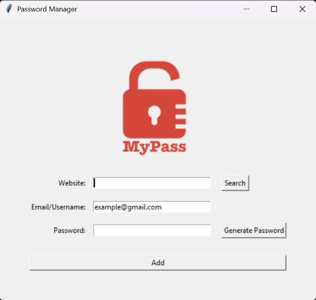

# 🔐 PyVault - Password Manager

A simple desktop password manager built with Python's Tkinter GUI toolkit. Generate strong random passwords, save your website credentials locally, and look them up whenever you need them — all through a clean, minimal interface.

## Features

- **Random Password Generator** — Creates strong passwords by mixing random letters, numbers, and symbols in randomized order
- **Save Credentials** — Store website, email/username, and password entries locally
- **Search/Lookup** — Instantly retrieve saved email and password for any website you've stored
- **Input Validation** — Prevents saving incomplete entries
- **JSON-Based Storage** — Credentials are stored in a structured `data.json` file, keyed by website
- **Simple GUI** — Built entirely with Tkinter, no external UI dependencies

## Screenshot



## Tech Stack

- Python 3
- Tkinter (GUI)
- `random` module (password generation)
- `json` module (data storage)

## Getting Started

### Prerequisites

- Python 3.x installed
- A `logo.png` file in the project directory (used as the app's canvas image)

### Installation

```bash
git clone https://github.com/NinjaVinja/pyvault-password-manager.git
cd pyvault-password-manager
python main.py
```

### Usage

**Saving a new entry:**
1. Enter the website name and your email/username
2. Click **Generate Password** to auto-create a strong password, or type your own
3. Click **Add** to save the entry
4. All fields are validated — you'll get a popup if anything is missing
5. Your credentials are saved to `data.json`, structured like this:
   ```json
   {
       "example.com": {
           "email": "example@gmail.com",
           "password": "generated-password"
       }
   }
   ```

**Looking up a saved entry:**
1. Type the website name into the Website field
2. Click **Search**
3. A popup will show the saved email and password for that site (or let you know if it's not found)

## Project Structure

```
pyvault-password-manager/
│
├── main.py          # Main application file
├── logo.png         # App logo/image
├── data.json        # Saved credentials (auto-generated)
└── README.md
```

## Future Improvements

- [ ] Encrypt saved passwords instead of storing in plain text
- [ ] Add a master password / login screen
- [ ] Add copy-to-clipboard functionality
- [ ] Add a confirmation dialog before saving new entries
- [ ] Add ability to edit/delete existing entries
- [ ] Migrate from local JSON to a proper database (SQLite)

## License

This project is open source and available under the [MIT License](LICENSE).

## Author

**Muhammad Taha Ahmad** ([NinjaVinja](https://github.com/NinjaVinja))
